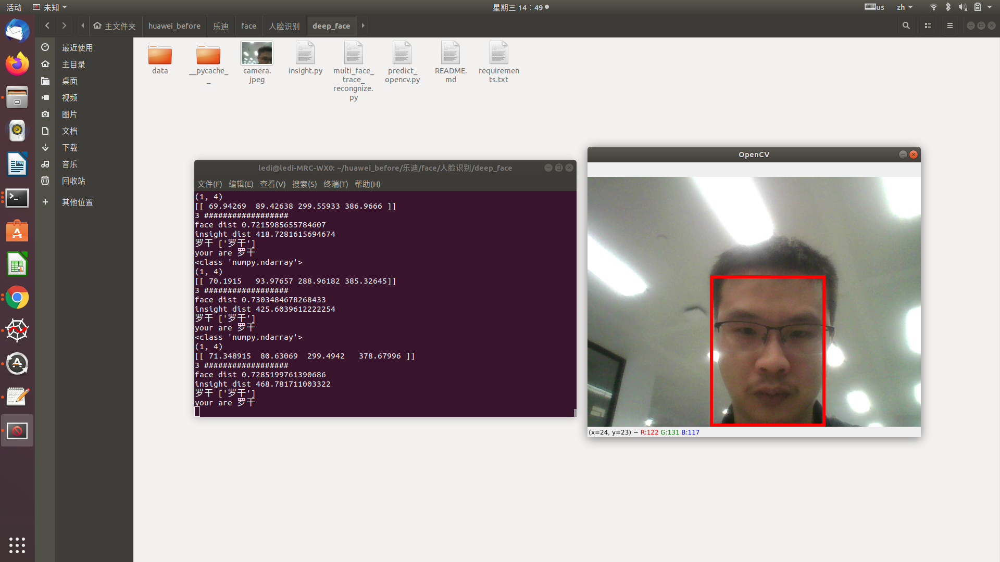

##### This open source project can count the flow of people entering the mall
##### 这个开源项目可以统计进入购物中心的人数
##### The underlying algorithm of this project is based on face recognition
##### 本项目的底层算法基于人脸识别

##### In order to facilitate the display of data, I wrote a simple web service that uses ajax to refresh the data in real time
##### 为了便于数据展示，我写了一个简单的web 服务，采用ajax 实现数据的实时刷新


##### I use MongoDB for the back-end database
##### 后端数据库我采用MongoDB


## Quick start

1. sudo apt install mongodb

1. Either install using pip  wait about some minintr:
    ```bash
    pip install  -r requirements.txt
    ```


2. add your face into data/test_image:
    ```
    
    cd ./deep_face/data/test_images
    
    mkdir your_name
    ```
3. add your face picture into /deep_face/data/test_images


4.  run the code :
    ```
    python multi_face_trace_recongnize.py
    ```
5.  ```
    cd web_ui
    python server.py
    ```    

web page


 A full face tracking example by opencv can be found at 




在mtcnn 下加入下面代码

if str(boxes)=='None':
	selected_boxes.append(None)
	selected_probs.append([None])
	selected_points.append(None)
	continue
